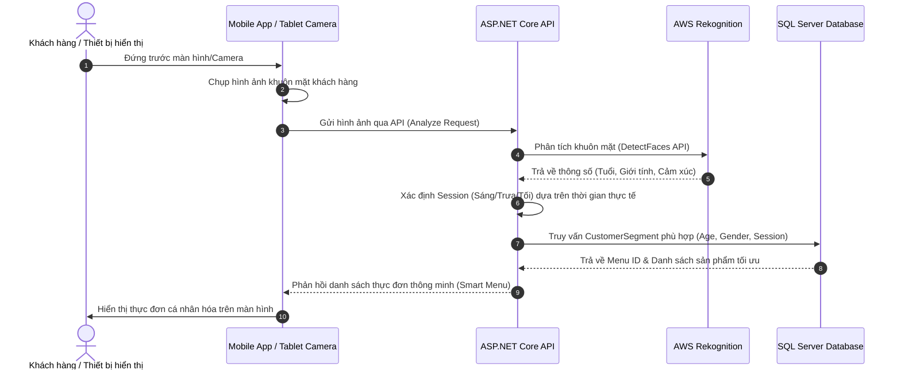

# 🌟 SmartMenu With AI - Hệ thống thực đơn thông minh tích hợp AI nhận diện khách hàng

**SmartMenu With AI** là giải pháp quản lý thực đơn thông minh dành cho các thương hiệu ẩm thực, chuỗi nhà hàng và quán cafe. Hệ thống sử dụng công nghệ trí tuệ nhân tạo phân tích khuôn mặt (**AWS Rekognition**) để tự động nhận diện nhân khẩu học của khách hàng (Độ tuổi, Giới tính, Cảm xúc) và thời gian trong ngày (Morning/Afternoon/Evening) từ đó gợi ý thực đơn (Menu) phù hợp nhất theo thời gian thực nhằm tối ưu hóa doanh thu và tăng trải nghiệm khách hàng.

---

## 📸 Quy trình đề xuất thực đơn thông minh (AI Flow)



---

## ✨ Các tính năng nổi bật

1. **Nhận diện khuôn mặt & Phân khúc khách hàng (AI Demographic Analytics)**:
   - Tích hợp **AWS Rekognition** phân tích hình ảnh từ Camera để ước lượng độ tuổi, xác định giới tính và cảm xúc của khách hàng.
   - Phân chia thời gian gọi món thành các khung giờ (Sáng, Trưa, Chiều, Tối).
2. **Quản lý phân khúc khách hàng động (Dynamic Customer Segmentation)**:
   - Quản trị viên có thể cấu hình các tập khách hàng mẫu (ví dụ: *Nữ giới, Độ tuổi 18-25, Khung giờ chiều* -> Gợi ý các món Trà sữa, Smoothie).
3. **Cổng thanh toán trực tuyến PayOS**:
   - Tích hợp cổng thanh toán trực tuyến **PayOS** (Cassso) giúp các thương hiệu đăng ký gói dịch vụ (Subscription Plans) một cách tự động và bảo mật.
4. **Hệ thống gửi Email tự động**:
   - Gửi hóa đơn, thông tin tài khoản và mã xác thực giao dịch qua hệ thống SMTP Gmail.
5. **Cổng quản trị Portal Web (Admin & Brand Dashboards)**:
   - Biểu đồ thống kê doanh thu, số lượt truy cập (Sử dụng Chart.js).
   - Quản lý Thương hiệu (Brands), Cửa hàng (Stores), Danh mục (Categories), Sản phẩm (Products).
   - Thiết lập cấu hình Menu, liên kết Menu với các Phân khúc khách hàng (Customer Segments) và Vị trí hiển thị (List Positions).
6. **Ứng dụng Mobile Client**:
   - Hỗ trợ chụp ảnh trực quan, đồng bộ hóa API nhận diện và hiển thị giao diện Menu tối ưu nhất cho khách hàng.

---

## 🛠️ Công nghệ sử dụng (Technology Stack)

### 1. Backend (API & Business Logic)
- **Framework**: .NET 8 (ASP.NET Core Web API)
- **Database Access**: Entity Framework Core (SQL Server)
- **Design Patterns**: Repository Pattern, Unit of Work, Dependency Injection (DI)
- **Cloud Services**: 
  - **AWS Rekognition**: Nhận diện & phân tích đặc điểm khuôn mặt.
  - **AWS S3**: Lưu trữ hình ảnh sản phẩm và tài nguyên truyền thông.
- **Third-Party Integrations**:
  - **PayOS SDK**: Quản lý hóa đơn và cổng thanh toán.
  - **MailKit / SMTP**: Gửi email tự động.
  - **JWT (JSON Web Token)**: Xác thực & phân quyền (Role-based Authorization: Admin, Brand Owner, Store Manager, v.v.).
- **API Documentation**: Swagger / OpenAPI

### 2. Frontend Website (Portal Quản lý)
- **Framework**: React.js (v18) + TypeScript
- **Bundler**: Vite
- **UI Framework**: Chakra UI
- **State Management**: Redux Toolkit & React-Redux
- **Styling**: Vanilla CSS, Sass, Framer Motion (Hiệu ứng & Hoạt ảnh mượt mà)
- **Other libraries**: Axios, Chart.js, React-Router-Dom, React-Toastify, PayOS Checkout

### 3. Frontend Mobile App (Client/Tablet App)
- **Framework**: React Native + Expo (v51)
- **Libraries**:
  - `react-native-camera` / `expo-image-picker`: Chụp và xử lý ảnh.
  - `@react-navigation/native` & `native-stack`: Quản lý luồng màn hình.
  - `@react-native-async-storage/async-storage`: Lưu trữ cục bộ trạng thái đăng nhập.
  - `axios`: Kết nối API Backend.

---

## 📁 Cấu trúc thư mục dự án

```text
SmartMenu/
├── Backend/                                # SOURCE CODE BACKEND (.NET 8)
│   ├── FSU.SmartMenuWithAI.API/            # Lớp API Web Controllers, Middlewares, Program.cs
│   ├── FSU.SmartMenuWithAI.Repository/     # Lớp DbContext, Entities, Repositories & Migrations
│   ├── FSU.SmartMenuWithAI.Service/        # Lớp Services xử lý Logic nghiệp vụ & DTOs
│   ├── FSU.SmartMenuWithAI.API.sln         # File Solution (.sln) của dự án
│   ├── compose.yaml                        # File Docker Compose thiết lập SQL Server & Backend
│   └── README.Docker.md                    # Hướng dẫn chạy Docker cho Backend
│
├── Frontend/                               # SOURCE CODE FRONTEND
│   ├── Website/                            # Portal Web Quản lý (React + TypeScript)
│   │   └── SmartMenuProject/               # Mã nguồn trang Web Portal
│   └── MobileApp - Sample/                 # Ứng dụng di động (React Native + Expo)
│       └── SmartMenuApp/                   # Mã nguồn ứng dụng Client đề xuất menu
│
├── DBForOnline.sql                         # File Script Database online backup
└── SmartMenuAI.sql                         # File Script SQL Server khởi tạo cơ sở dữ liệu
```

---

## 🚀 Hướng dẫn cài đặt và khởi chạy dự án

### Bước 1: Thiết lập Cơ sở dữ liệu (Database Setup)
1. Mở **SQL Server Management Studio (SSMS)** hoặc công cụ quản lý SQL Server bất kỳ.
2. Tạo mới một cơ sở dữ liệu trống có tên là `SmartMenu`.
3. Mở và chạy toàn bộ nội dung file script `SmartMenuAI.sql` (hoặc `DBForOnline.sql`) để tạo cấu trúc bảng và chèn dữ liệu mẫu ban đầu.

---

### Bước 2: Cấu hình và Chạy Backend (.NET Core API)

#### 1. Cấu hình tệp `appsettings.json`
Đường dẫn file: `Backend/FSU.SmartMenuWithAI.API/appsettings.json`
Cập nhật chuỗi kết nối SQL Server và các thông tin dịch vụ của bạn:

```json
{
  "ConnectionStrings": {
    "DefaultConnection": "Server=YOUR_SERVER_NAME;Database=SmartMenu;uid=sa;pwd=YOUR_PASSWORD;TrustServerCertificate=True"
  },
  "JWT": {
    "ValidAudience": "User",
    "ValidIssuer": "http://localhost:7001",
    "SecretKey": "YOUR_SUPER_SECRET_KEY_MIN_32_CHARACTERS"
  },
  "AWS": {
    "AccessKeyId": "YOUR_AWS_ACCESS_KEY",
    "SecretAccessKey": "YOUR_AWS_SECRET_KEY"
  },
  "Smtp": {
    "Host": "smtp.gmail.com",
    "Port": "587",
    "Username": "YOUR_EMAIL@gmail.com",
    "Password": "YOUR_APP_PASSWORD",
    "From": "YOUR_EMAIL@gmail.com",
    "EnableSsl": true
  },
  "PayOS": {
    "ClientID": "YOUR_PAYOS_CLIENT_ID",
    "ApiKey": "YOUR_PAYOS_API_KEY",
    "ChecksumKey": "YOUR_PAYOS_CHECKSUM_KEY",
    "domain": "http://localhost:7001"
  }
}
```

#### 2. Khởi chạy cục bộ (Local Development)
Yêu cầu đã cài đặt **.NET 8 SDK**.

Chạy các lệnh sau trong terminal tại thư mục gốc của dự án:
```bash
# Di chuyển vào thư mục API
cd Backend/FSU.SmartMenuWithAI.API

# Khôi phục các gói nuget
dotnet restore

# Chạy ứng dụng
dotnet run
```
Sau khi chạy thành công, tài liệu Swagger API sẽ có tại: `http://localhost:7001/swagger/index.html` (hoặc cổng cấu hình tương đương).

#### 3. Khởi chạy bằng Docker Compose
Dự án có sẵn file `compose.yaml` ở thư mục `Backend` để khởi tạo cả SQL Server và Backend API tự động:

```bash
cd Backend
docker compose up --build
```
Ứng dụng sẽ khả dụng tại địa chỉ: `http://localhost:7000` hoặc cổng tùy chỉnh trong file compose.

---

### Bước 3: Khởi chạy Website Portal (Admin & Brand Dashboard)
Yêu cầu đã cài đặt **Node.js** (Phiên bản gợi ý >= 18).

1. Di chuyển vào thư mục dự án Web:
   ```bash
   cd Frontend/Website/SmartMenuProject
   ```
2. Tạo file `.env` từ file mẫu hoặc cấu hình trực tiếp để trỏ địa chỉ API về Backend:
   ```env
   VITE_API_URL=http://localhost:7001
   ```
3. Cài đặt các thư viện phụ thuộc:
   ```bash
   npm install
   ```
4. Khởi chạy chế độ lập trình (Development mode):
   ```bash
   npm run dev
   ```
5. Mở trình duyệt và truy cập: `http://localhost:5173` (hoặc cổng hiển thị trong Terminal).

---

### Bước 4: Khởi chạy Ứng dụng Mobile Client (React Native - Expo)
Yêu cầu cài đặt ứng dụng **Expo Go** trên thiết bị di động (iOS/Android) hoặc chạy trên Emulator.

1. Di chuyển vào thư mục dự án Mobile:
   ```bash
   cd "Frontend/MobileApp - Sample/SmartMenuApp"
   ```
2. Tạo file `.env` cấu hình API:
   ```env
   API_URL=http://<IP_MAY_TINH_CUA_BAN>:7001
   ```
   *(Lưu ý: Sử dụng IP cục bộ của máy tính dạng `192.168.x.x` để điện thoại và máy tính kết nối được với nhau).*
3. Cài đặt các thư viện phụ thuộc:
   ```bash
   npm install
   ```
4. Khởi chạy dự án với Expo:
   ```bash
   npx expo start
   ```
5. Sử dụng Camera điện thoại quét mã QR hiển thị trên màn hình máy tính để khởi chạy ứng dụng thông qua **Expo Go**.

---

## 👥 Tài khoản mặc định để thử nghiệm (Default Accounts)

Bạn có thể sử dụng các tài khoản có sẵn trong cơ sở dữ liệu (được tạo bởi file script SQL) để đăng nhập và kiểm thử hệ thống:

- **Quản trị hệ thống (System Admin)**:
  - Email/Tài khoản: `admin@smartmenu.com` (hoặc cấu hình trong DB)
  - Mật khẩu: `12345` / `Admin@123`
- **Quản lý thương hiệu (Brand Manager)**:
  - Email/Tài khoản: `brand@smartmenu.com`
  - Mật khẩu: `12345`

---

## 📝 Giấy phép và liên hệ
Dự án được xây dựng và phát triển phục vụ mục đích học tập và nghiên cứu công nghệ đồ án môn học EXE201 tại FPT University. Mọi thắc mắc và đóng góp ý kiến vui lòng liên hệ thông qua hòm thư hỗ trợ của dự án.
